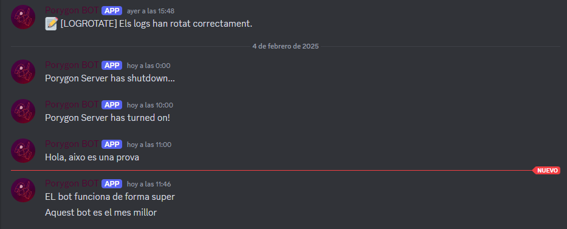

# QuickDiscordMsg
Bot de Discord en Python que envia un missatge a un canal específic.

## Instal·lacions neccesaries

```python
# Instal·lar la llibreria de discord
pip install discord

# Windows
python.exe -m pip install --upgrade pip

# Linux
python3 -m pip install --upgrade pip
sudo apt install python3-pip  # (Si pip no està instal·lat)
```

## Com executar el bot

```python
python3 script.py "Aquest bot es el mes millor"
```



Aquest bot ofereix una gran varietat d'usos per adaptar-se a les teves necessitats. Aquí tens alguns exemples de com el pots emprar:

- Enviar un missatge quan el sistema s'inicia (per exemple, "El servidor s'ha ences").
- Enviar un missatge abans que el sistema s'apagui (per exemple, "El servidor s'ha apagat").
- Notificar cada vegada que un usuari inicia sessió per SSH (per exemple, "L'usuari {username} ha iniciat sessió per SSH a {hostname}").
- Enviar un missatge quan s'executa una tasca programada amb cron (per exemple, "S'ha fet l'actualització setmanal").
- Gestionar els logs mitjançant logrotate.
- Fer seguiment de les connexions d'administradors (per exemple, saber quantes vegades es fa login amb root mitjançant PAM).
